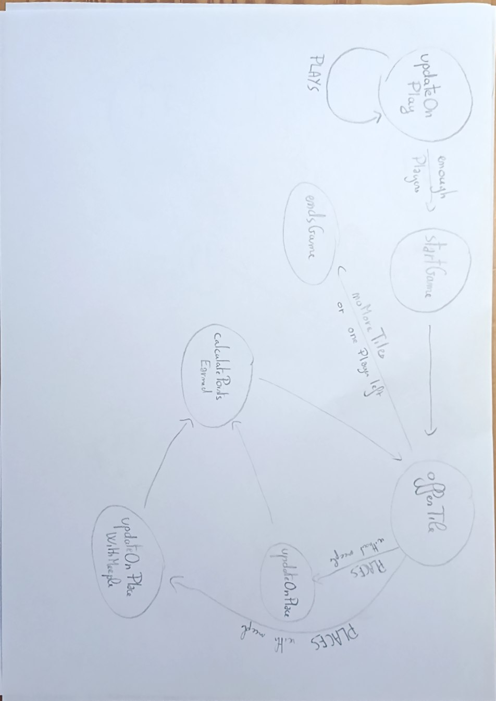

# Programme Arbitre Carcassonne - Projet l3

## Table des matières

1. [Rôle de l'arbitre](#1-rôle-de-larbitre)
2. [Lancer le programme arbitre](#2-lancer-le-programme-arbitre)
3. [Connexion et initialisation](#3-connexion-et-initialisation)
4. [Déroulement d'une partie](#4-déroulement-dune-partie)
5. [Placement d'une tuile](#5-placement-dune-tuile)
6. [Placement d'un meeple](#6-placement-dun-meeple)
7. [Calcul des points](#7-calcul-des-points)
8. [Système de blames](#8-système-de-blames)
9. [Système de timeout](#9-système-de-timeout)
10. [Expulsion d'un joueur](#10-expulsion-dun-joueur)
11. [Fin de partie](#11-fin-de-partie)
12. [Cas non conformes gérés](#12-cas-non-conformes-gérés)
13. [Fonctionnement général](#13-fonctionnement-général)

---

## 1. Rôle de l'arbitre

L'arbitre est le programme central qui orchestre une partie de Carcassonne en réseau. Il est responsable de :

- Gérer les connexions des joueurs et le déroulement des différentes étapes de la partie
- Piocher et proposer les tuiles aux joueurs
- Valider chaque placement de tuile et de meeple
- Calculer et distribuer les points en cours de partie et en fin de partie
- Renvoyer les meeples au joueurs pendant la partie
- Faire respecter les règles en blâmant les joueurs en cas d'action non conforme ou ne répondant pas dans le temps imparti
- Expulser les joueurs atteignant le nombre maximum de blames

L'arbitre gère la logique du jeu en utilisant la librairie [game-elements](https://github.com/Tom-Taffin/game-elements_projet_l3) et communique avec tous les participants via un **réflecteur** (serveur de messagerie réseau) en utilisant la librairie [carcassonne_connection_library](https://github.com/Tom-Taffin/carcassonne_connection_library_projet_l3). Chaque message est envoyé ou reçu sous la forme :

```
<expéditeur_id> <COMMANDE> [arguments...]
```
  
Pour en savoir plus sur les messages, il faut se référer à [message_carcassone](https://github.com/Tom-Taffin/participant_infos_projet_l3/blob/master/messages_carcassonne.md) dans participant_infos.

---

## 2. Lancer le programme arbitre

### Lancement

Se référer au lancement dans [participant_info](https://github.com/Tom-Taffin/participant_infos_projet_l3/blob/master/participant_info.md).

---

## 3. Connexion et initialisation

### 3.1 Connexion au réflecteur

Au démarrage, l'arbitre se connecte au réflecteur et annonce son rôle :

```
referee1 ELECTS referee referee1
```

L'arbitre attend ensuite que tous les joueurs se connectent via la commande `PLAYS`.

### 3.2 Arrivée des joueurs

Chaque joueur envoie :
```
alice PLAYS alice
```

L'arbitre répond en lui attribuant le rôle `player` :
```
referee1 ELECTS player alice
```

### 3.3 Démarrage de la partie

Une fois que tous les joueurs attendus sont connectés, la partie démarre automatiquement :

```
referee1 STARTS                                 // la partie commence
referee1 BLAMES 5                               // joueur explusé si il reçoit 5 blames
referee1 COLLECTS alice regular 8               // alice reçois 8 "regular meeeple"
referee1 COLLECTS bob regular 8                 // bob reçois 8 "regular meeeple"
referee1 OFFERS alice c1-f2r3f4-f4-f4r3f2       // la tuile piochée est proposée à alice
```

L'ordre des joueurs est **déterminé aléatoirement** au lancement.

> **Note :** Tout joueur envoyant `PLAYS` après le début de la partie est immédiatement expulsé :
> ```
> referee1 EXPELS latePlayer
> ```

---

## 4. Déroulement d'une partie

Chaque tour suit le schéma suivant :

```
┌─────────────────────────────────────────┐
│OFFERS → tuile piochée proposée au joueur│
│         ↓                               │
│  PLACES → joueur pose la tuile          │
│    (avec ou sans meeple)                │
│         ↓                               │
│  COLLECTS (si zone fermée avec meeple)  │
│  SCORES   (si zone fermée avec meeple)  │
│         ↓                               │
│  Tour suivant (OFFERS au joueur suivant)│
└─────────────────────────────────────────┘
```

### Exemple de tour complet avec meeple et score

```
referee1 OFFERS alice c1-f2r3f4-f4-f4r3f2          // tuile proposée par l'arbitre à alice
alice    PLACES alice N 1 0 regular T0             // alice envoi son coup
referee1 PLACES alice N 1 0 regular T0             // arbitre valide coup
referee1 COLLECTS alice regular 1 0                // alice récupère un "regular meeple"
referee1 COLLECTS bob regular 4 6                  // bob récupère un "regular meeple"
referee1 SCORES alice 3                            // alice marque 3 points
referee1 SCORES bob 5                              // bob marque 5 points
referee1 OFFERS bob r1-r1-f2-f2                    // tuile proposée par l'arbitre à bob
```

---

## 5. Placement d'une tuile

Le joueur courant répond à `OFFERS` avec la commande `PLACES` :

```
<id> PLACES <id> <orientation> <x> <y>
```

ou avec un meeple :

```
<id> PLACES <id> <orientation> <x> <y> <type_meeple> <position_meeple>
```

### Orientations valides

| Caractère | Orientation |
|-----------|-------------|
| `N`       | Nord        |
| `E`       | Est         |
| `S`       | Sud         |
| `W`       | Ouest       |

### Position d'un meeple sur une zone

La position est composée d'une **direction** (`T`, `R`, `B`, `L`) et d'un **index** :

```
T0   → zone 0 du bord haut
R1   → zone 1 du bord droit
A    → abbaye (si la tuile en possède une)
```

Le nombre de zones par bord dépend de la tuile. Un bord simple a 1 zone (index `0`), un bord complexe peut en avoir plusieurs.

---

## 6. Placement d'un meeple

### 6.1 Sur une zone normale

```
alice PLACES alice N 1 0 regular T0
```

L'arbitre vérifie :
- Le joueur dispose encore de meeples
- Le type est `regular`
- La position est syntaxiquement valide
- L'index est dans les bornes de l'arête
- La zone n'est pas de type `FIELD`
- Aucune zone connectée sur le plateau ne contient déjà un meeple

### 6.2 Sur une abbaye

Si la tuile possède une abbaye, le joueur peut y poser un meeple avec la position `A` :

```
alice PLACES alice N 2 1 regular A
```

L'arbitre vérifie que la tuile possède bien une abbaye et qu'elle n'est pas déjà occupée.

### 6.3 Rollback en cas d'échec

Si le meeple ne peut pas être posé **après** que la tuile a été placée, la tuile est **retirée du plateau** pour conserver un état cohérent. Les connexions de zones créées lors du placement sont également annulées.

---

## 7. Calcul des points

### 7.1 En cours de partie

Après chaque placement, l'arbitre vérifie si des zones viennent d'être fermées.

#### Routes

Une route est fermée quand toutes ses extrémités rejoignent une ville, une abbaye ou un carrefour. Le joueur majoritaire marque **1 point par tuile** de la route.

```
referee1 COLLECTS alice regular 1 0
referee1 SCORES alice 4
```

#### Villes

Une ville est fermée quand elle est entièrement entourée. Le joueur majoritaire marque **2 points par tuile**, et **2 points supplémentaires par bouclier** présent dans la ville.

```
referee1 COLLECTS alice regular 2 1
referee1 SCORES alice 8
```

#### Abbayes

Une abbaye est fermée quand elle est entourée de ses 8 tuiles voisines (côtés + coins). Le joueur marque **9 points**.

```
referee1 COLLECTS bob regular 3 3
referee1 SCORES bob 9
```

### 7.2 Majorité de meeples

Quand une zone se ferme avec des meeples de plusieurs joueurs, **seul le joueur ayant le plus de meeples** sur la zone marque les points. En cas d'égalité, **tous les joueurs à égalité** marquent les points.

```
referee1 COLLECTS alice regular 1 0
referee1 COLLECTS bob regular 2 0
referee1 SCORES alice 6
referee1 SCORES bob 6
```

### 7.3 En fin de partie

Les zones non fermées sont comptées avec les règles suivantes :

| Type de zone     | Points                                          |
|------------------|-------------------------------------------------|
| Route non fermée | 1 point par tuile                               |
| Ville non fermée | 1 point par tuile (+ 1 par bouclier, sans ×2)   |
| Abbaye non fermée| 1 + 1 point par tuile adjacente (max 9)         |

---

## 8. Système de blames

### 8.1 Principe

L'arbitre envoie un blame à un joueur dont l'action est non conforme :

```
referee1 BLAMES <joueur_id> <raison>
```

Au démarrage, le nombre maximum de blames est communiqué :
```
referee1 BLAMES 5
```

### 8.2 Liste des raisons de blame

| Raison                          | Cause                                                                 |
|---------------------------------|-----------------------------------------------------------------------|
| `illegal-tile-move`             | Tuile placée sur une case occupée, incompatible avec ses voisines, ou sans tuile adjacente |
| `illegal-orientation-syntax`    | Caractère d'orientation invalide (différent de N, E, S, W)          |
| `illegal-meeple-move`           | Meeple sur zone FIELD, zone déjà occupée, type invalide, plus de meeples disponibles, abbaye sans abbaye |
| `illegal-meeple-position-syntax`| Syntaxe de position invalide, index hors bornes de l'arête           |
| `illegal-turn`                  | Un joueur envoie PLACES alors que ce n'est pas son tour              |
| `illegal-id`                    | L'`id` et l'`idPrime` dans la commande PLACES sont différents        |
| `timeout`                       | Le joueur n'a pas répondu dans le temps imparti                      |

---

## 9. Système de timeout

### 9.1 Déclenchement

Dès qu'une tuile est proposée via `OFFERS`, un minuteur de **30 secondes** est lancé. Si le joueur ne répond pas dans ce délai, l'arbitre envoie automatiquement :

```
referee1 BLAMES alice timeout
```

### 9.2 Annulation

Le minuteur est **annulé dès que le joueur envoie une commande PLACES valide** (avant la vérification de contenu).

### 9.3 Rechargement après blame

Si le joueur reçoit un blame mais n'est pas encore expulsé (blames < 5), le minuteur **repart pour 30 secondes** pour lui laisser la possibilité de rejouer :

```
referee1 BLAMES alice illegal-tile-move
→ Timer relancé 30s
referee1 BLAMES alice timeout       ← si toujours pas de réponse
```

### 9.4 Accumulation de timeouts

Un joueur qui ne répond jamais finira par accumuler 5 blames de type `timeout` et sera expulsé :

```
referee1 BLAMES alice timeout   (blame 1)
referee1 BLAMES alice timeout   (blame 2)
referee1 BLAMES alice timeout   (blame 3)
referee1 BLAMES alice timeout   (blame 4)
referee1 BLAMES alice timeout   (blame 5)
referee1 EXPELS alice
```

---

## 10. Expulsion d'un joueur

### 10.1 Déclenchement

Un joueur est expulsé dès qu'il atteint **5 blames** (quel qu'en soit la raison) :

```
referee1 EXPELS alice
```

### 10.2 Récupération des meeples

Tous les meeples du joueur expulsé sur le plateau sont **récupérés** et signalés via `COLLECTS` :

```
referee1 COLLECTS alice regular 1 0
referee1 COLLECTS alice regular 3 2
```

### 10.3 Reprise de la partie

- Si le joueur expulsé **était le joueur courant**, la partie reprend immédiatement avec le joueur suivant (`OFFERS` est envoyé).
- Si le joueur expulsé **n'était pas le joueur courant**, la partie continue normalement sans lui.

### 10.4 Un seul joueur restant

Si l'expulsion ne laisse qu'un seul joueur dans la partie, la fin de partie est déclenchée immédiatement :

```
referee1 ENDS [alice]
```

---

## 11. Fin de partie

### 11.1 Déclenchement

La fin de partie est déclenchée dans l'un des cas suivants :
- Le deck est **vide** (plus aucune tuile à piocher)
- Il ne reste **qu'un seul joueur** en jeu

### 11.2 Calcul final

L'arbitre calcule les points de toutes les zones non fermées encore occupées par des meeples, envoie les `COLLECTS` et `SCORES` correspondants, puis annonce le ou les gagnants :

```
referee1 COLLECTS alice regular 4 2
referee1 SCORES alice 3
referee1 COLLECTS bob regular 1 1
referee1 SCORES bob 2
referee1 ENDS [alice]
```

En cas d'égalité, tous les joueurs à égalité sont déclarés vainqueurs :

```
referee1 ENDS [alice, bob]
```

---

## 12. Cas non conformes gérés

### 12.1 Placement de tuile

| Cas                                          | Comportement                     |
|----------------------------------------------|----------------------------------|
| Case déjà occupée                            | `blame illegal-tile-move`        |
| Bords incompatibles avec les voisins         | `blame illegal-tile-move`        |
| Aucune tuile adjacente (case isolée)         | `blame illegal-tile-move`        |
| Orientation invalide (ex: `X`)               | `blame illegal-orientation-syntax` |
| PLACES reçu alors que l'arbitre n'attend pas | Ignoré silencieusement           |
| PLACES envoyé par un non-joueur              | Ignoré silencieusement           |
| PLACES ce n'est pas le tour du joueur        | `blame illegal-turn`             |
| `id` différent de `idPrime`                  | `blame illegal-id`               |

### 12.2 Placement de meeple

| Cas                                           | Comportement                           |
|-----------------------------------------------|----------------------------------------|
| Type différent de `regular`                   | `blame illegal-meeple-move`            |
| Position syntaxiquement invalide (ex: `Z99`)  | `blame illegal-meeple-position-syntax` |
| Index hors bornes (ex: `T5` sur bord à 1 zone)| `blame illegal-meeple-position-syntax` |
| Zone de type `FIELD`                          | `blame illegal-meeple-move`            |
| Zone connectée déjà occupée sur le plateau    | `blame illegal-meeple-move`            |
| Joueur n'ayant plus de meeples                | `blame illegal-meeple-move`            |
| Abbaye déjà occupée                           | `blame illegal-meeple-move`            |
| Position `A` sur tuile sans abbaye            | `blame illegal-meeple-move`            |
| Meeple refusé → tuile **retirée** du plateau  | Rollback complet (tuile + connexions)  |

### 12.3 Phase de connexion

| Cas                                        | Comportement                    |
|--------------------------------------------|---------------------------------|
| PLAYS envoyé par un nouveau joueur après le début de la partie    | `EXPELS` immédiat               |
| Même joueur envoie PLAYS deux fois          | Ignoré (joueur déjà enregistré) |

### 12.4 Robustesse du plateau

| Cas                                          | Comportement                                    |
|----------------------------------------------|-------------------------------------------------|
| Tuile piochée sans position valide           | L'arbitre pioche automatiquement une autre tuile|
| Aucune tuile restante n'est plaçable         | Fin de partie déclenchée                        |
| Connexions de zones après rollback           | Entièrement annulées (bidirectionnel)           |

## 13. Fonctionnement général

L'arbitre s'articule autour de deux fichiers principaux: **Game.java** pour la logique du jeu, et **RefereeView.java** pour communiquer avec le réflecteur.

On peut voir **RefereeView.java** comme une machine à état, où les états représentent les différentes parties d'un tour de jeu.



Si un état a besoin de vérifier, ou de mettre à jour un élément de jeu, il délègue la tâche à **Game.java**.

**Game.java** garde en mémoire tout ce qui se rapporte à la partie en cours: les joueurs, le plateau, les meeples... Et dispose de toutes les méthodes nécessaires pour interagir avec.

Pour le plateau, les joueurs et le score, la logique devient compliqué à gérer au sein d'une seule classe, donc on a préféré faire des classes *Manager* pour ces éléments auxquels **Game.java** va faire appel pour déléguer les tâches.

**RefereeView.java** gère également la distribution des blâmes aux joueurs, ainsi que leur expulsion de la partie.

Voyons un exemple de déroulement d'un état:

Dans l'état *OfferTile*, on est au début du tour. On doit piocher une tuile et l'offrir au joueur courant. **RefereeView.java** commence par demander à **Game.java** de piocher une tuile.

Ensuite, **RefereeView.java** va envoyer cette tuile au joueur via le réflecteur, puis se mettre en attente d'une commande *PLACES*.

Selon la commande *PLACES* reçu, la machine à états va aller dans l'état correspondant et continuer le tour de jeu.

Si aucune commande *PLACES* n'est reçu au bout d'un certain temps, le programme lui distribue un blâme.

Si, durant l'état *OfferTile*, la pioche est vide ou il n'y a plus qu'un joueur en jeu, la machine à état bascule dans *endsGame* et le jeu se termine.
